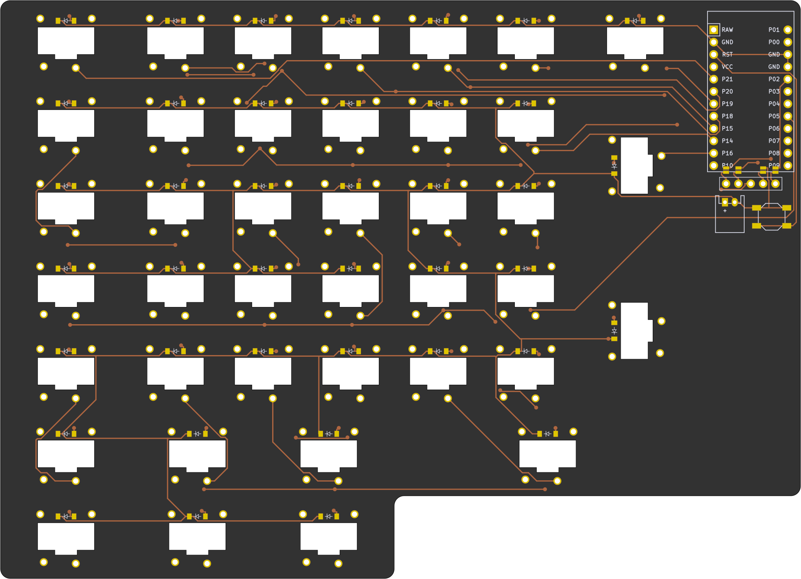
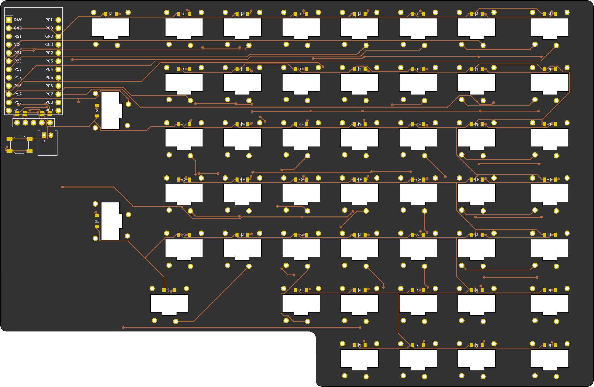
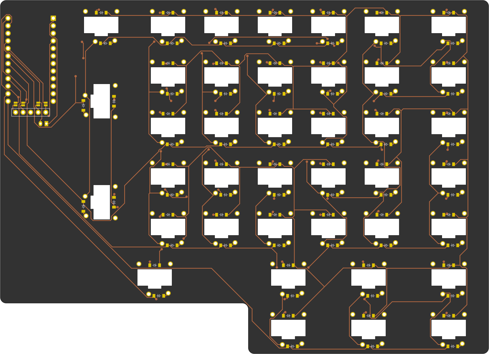
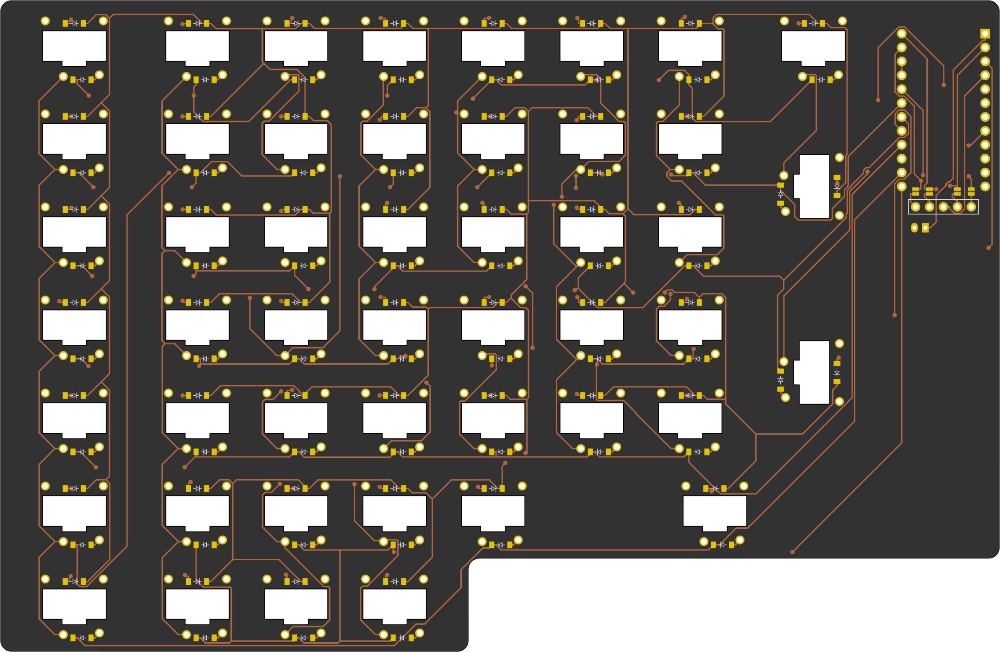

# Split Typematrix 2022 
## A Typematrix 2022 style autogenerated keyboard

## Layout
The Typematrix 2022 was one of the first ortholinear ergo keyboards and arguably the best layout ever made `[citation needed]`

See [An evaluation of the TypeMatrix ergonomic keyboard](http://www.typematrix.com/documents/TypeMatrix_study.pdf)
left | right
-|-
 | 
backside|backside
 | 

The interesting thing about this keyboard is that it's a declarative design:
* Layout is declared using [Ergogen](https://github.com/mrzealot/ergogen/). 
* The build system uses Ergogen to translate YAML to a KiCad PCB and plate files for FR-4 fab or laser cutting
* uses [kicad-automation-scripts](https://github.com/productize/kicad-automation-scripts) and [FreeRouting](https://github.com/freerouting/freerouting) to **automatically route the traces on the PCB**
* uses [KiKit](https://github.com/yaqwsx/KiKit) to render PCB previews (see top of this file) and production-ready **Gerber files**

## Features

* **Typematrix 2022** inspired split layout
* **Kailh Choc PG1232** choc mini, ulta low profile key switches
* [Nice!nano](https://nicekeyboards.com/nice-nano) optimised, but any promicro should work (bottom up) 
* [Nice!view](https://nicekeyboards.com/nice-view) support
  
## Todo
* Remove clutter and unnecesary outlines
* Top plate generation
* Bottom Plate (Thick PCB with cutouts for all components placed at the bottom. Optimised for maximum thinness)
* Remove or document magic numbers
* Backlight
* 3D models for 2x1.5u big enter key caps
* SMD footrints
* Better nice!nano footprint, steal from https://github.com/bstiq/nice-nano-kicad
* Middle bracked PCB with touchpad (Holds both halves together rigidly)
* Align board edges with actual keycap size
* stabilizer cutouts (Kailh says stabilizers are not supported for PG1232! :worried:) Needs more research...
  Thanks https://github.com/jasonhazel for measuring the ChocFox WOB 3u spacebar stabilizer spacing. (40mm)

## How to

If you would like to modify this:
* fork it
* change `input/config.yaml` to your liking
* push your changes; the `build.yml` GitHub Workflow will pick it up, autoroute and generate Gerbers, all in a zip file.
  See https://github.com/soundmonster/samoklava/actions
* or:
  * make sure to have Docker CLI and NodeJS installed
  * run `make setup clean all`
  * check the `output` folder for KiCad PCBs and Gerbers

See the [workflow](.github/workflows/build.yml) or the [Makefile](Makefile) for more details.

## Disclaimer

**Work in progress!**

Based on the work of Soundmonster https://github.com/soundmonster/samoklava/

Requires ergogen 4.x

Only connect battery if a nice!nano board is used!
